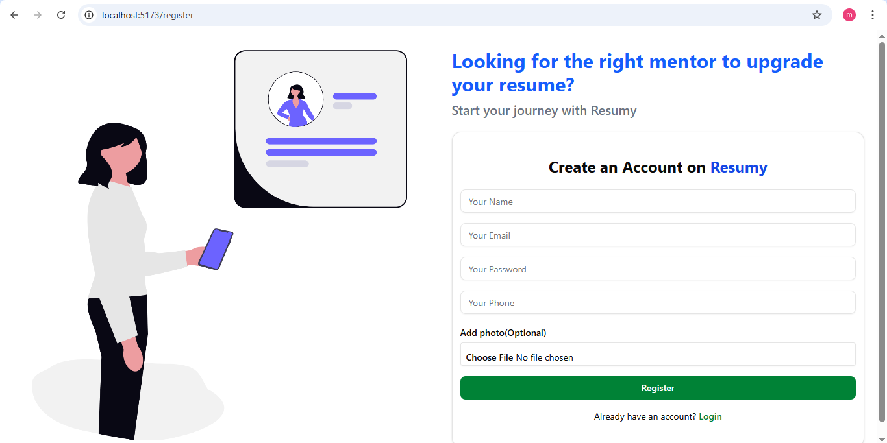
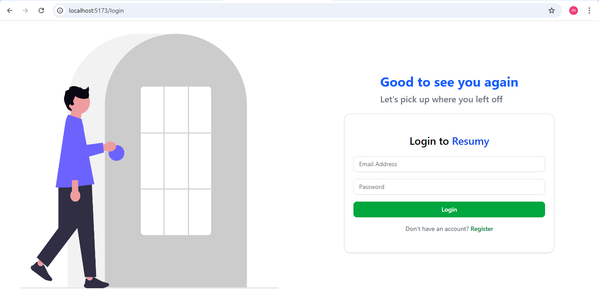
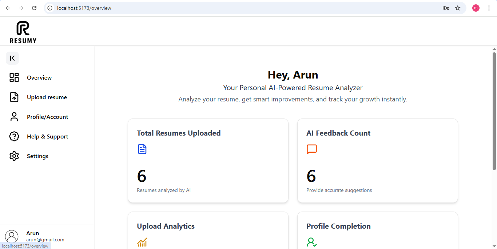
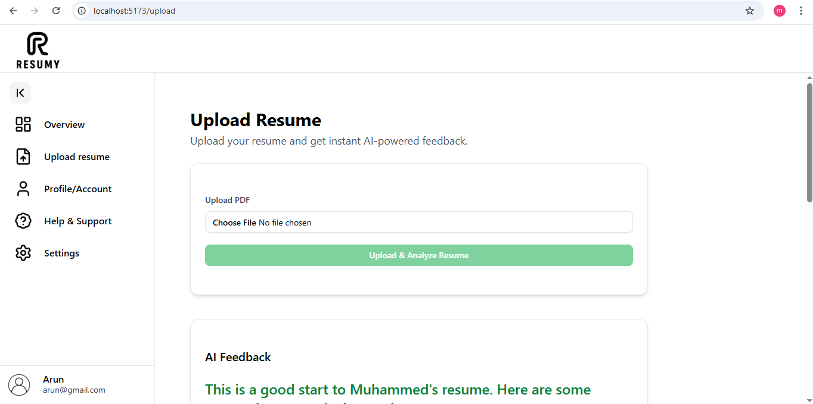
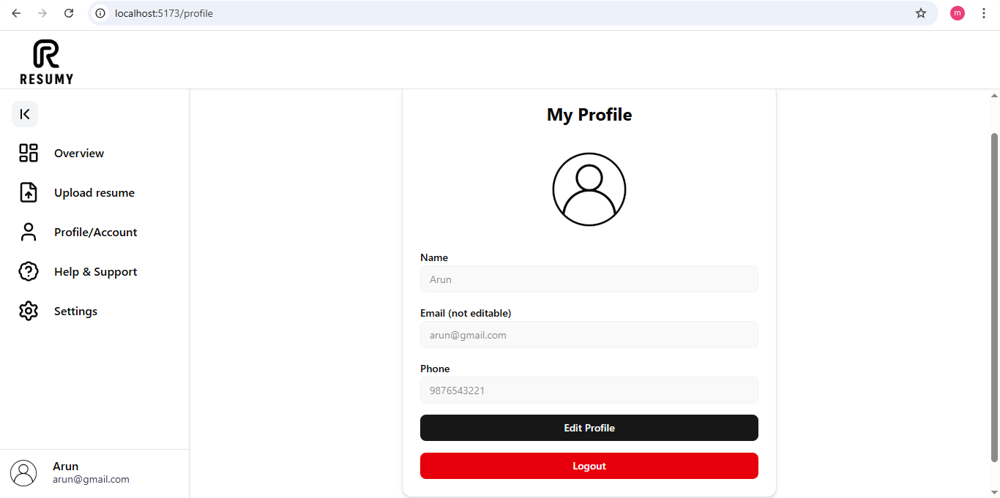

## Resume Advisor ##

This is a small AI based project that helps users upload their resumes and get AI-based suggestions for improvement in their resume. So that they can make clean resumes with the help of AI , especially designed to guide beginner students to stand out among thousands of applicants.  

## Features

* Uploads pdf or doc files
* Get AI description about the resume
* Get AI feedback and improvements about the resume
* Use backend to store user data (login,register)
* Responsive UI with tailwindCSS and shadcn for UI component
* Only logged users can have the access to these features

## Techs used

* React , tailwindCSS, shadcn UI
* Nodejs, express, mongoDB
* OpenAI

# Screenshots

* Register page

* Login page

* Home page

* Main Page

* Profile page

